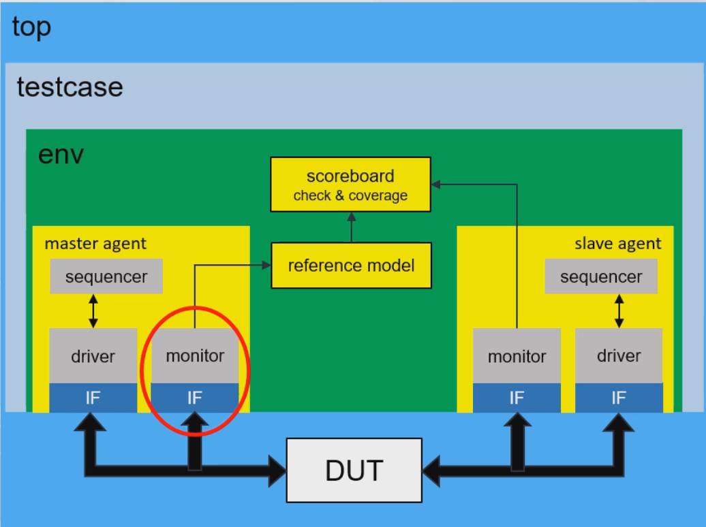

# README

## PHASE

All components (eg. uvm_driver, uvm_monitor ...) in the UVM platform have the concept of PHASEs, whith are comprised of tasks/functions executed in a certain order.

`build_phase` - `connect_phase` - `end_of_elaboration_phase` - `start_of_simulation_phase` - `run_phase` - `extract_phase` - `check_phase` - `report_phase`

Those above "\*\_phase" are tasks/functions, you need to implement (override) them in your component.

UVM platform will run them in the order.

## Register UVM class

If it's a UVM component(组件), it should have a `uvm_component_utils` macro
Else you should have a `uvm_object_utils` macro
