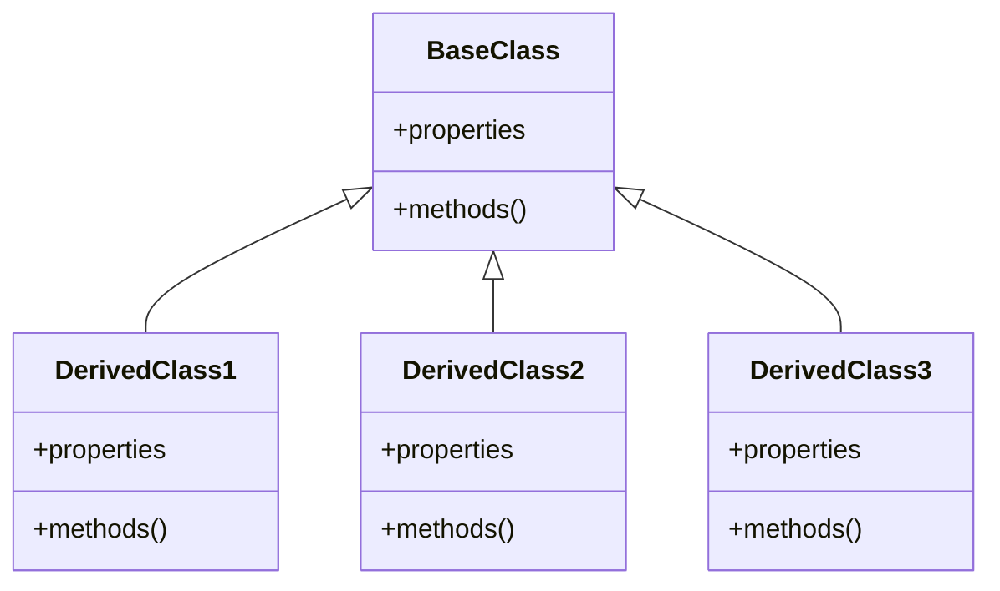
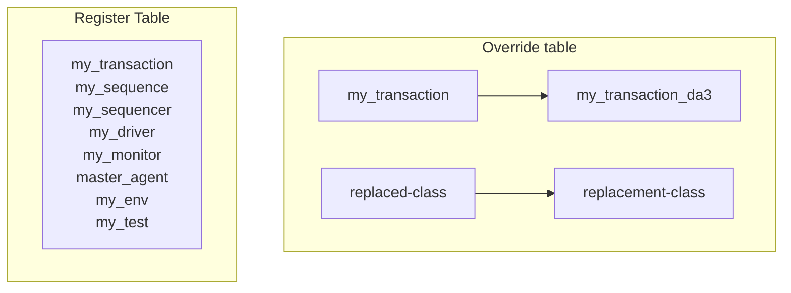

# UVM LEARN

## 疑惑

### lab_03_factory

1. `my_driver_count` 并没有成功覆盖 `my_driver`
2. 在 `my_test_da3.sv`
   1. 会报错: `set_type_override_by_type(my_driver::get_type(), my_driver_count::get_type());`
   2. 不报错, 但不覆盖: `set_inst_override_by_type("my_env.m_agent.m_drv.*", my_driver::get_type(), my_driver_count::get_type());`

    ```log
        # UVM_FATAL @ 0: reporter [FCTTYP] Factory did not return a component of type 'my_driver'. A component of type 'my_driver_count' was returned instead. Name=m_drv Parent=master_agent contxt=uvm_test_top.my_env.m_agent
    ```

## UVM Factory

### What is Factory?

- The UVM Factory mechanism(机制) allows users to replace different class(类) without modifying the code
- Factory is a built-in data structure in UVM
  - It operates within the entire platform space
  - It has only one instantiated object (i.e., a singleton class)
  - It serves as a polymorphic(多态) constructor --> Allows users to instantiate many different types of class using just one function.
- Factory object must be derived from a base class (called `uvm_object`?)
  - It's in order to return multiple types of class from just one function



### How Factory Work?

UVM has 2 LUTs (Look-Up Tables) to implement Factory mechanism:

1. Register table
2. Override table
   1. The replacement classes must have an inheritance(继承) relationship



The workflow of the Factory:

1. Register user-defined classes in the register-table
2. Use `class_name::type_id::create()` to create an object instead `new()`
3. Add replacement classes in the replace-table
   - The replaced-class must be the base-class of the replacement-class
4. UVM will automatically implement the Factory mechanism based on these 2 tables during the simulation

### Register Macro

\``uvm_object_utils` and \``uvm_object_param_utils`
\``uvm_component_utils` and \``uvm_component_param_utils`

The workflow of these 4 register macro:

1. Create a proxy(代理) class for the registered class: which named 'type_id'
   - 'type-id' is specifically used to replace the `new()` function, so it's called a proxy class
2. Create a registered class, Register the class in Factory (complex process)
3. Create a static function `type_id::create()`
   - To create an object of the specified class based on replace-table
4. Create a static function `type_id::get_type()`
5. Create a not-static function `type_id::get_object_type()`

The workflow of the create() function:

1. Call get() function of Factory to get Factory object
2. Based on the name of this-class, find wheather it's in the replace-table
   1. If it's not in the replace-table, call the `new()` function of this-class
   2. Else, call the `new()` function of the replacement-class

### Override Function

There are 2 common override functions,
These 2 functions exist in components and need to be used in `build_phase()` normally

```cpp
// original_class_name: the class that needs to be replaced
// replacement_class_name: the class that replaces the original class
set_type_override_by_type(
    original_class_name::get_type(),
    target_class_name::get_type()
);

set_inst_override_by_type(
    "original_inst_path",
    original_class_name::get_type(),
    target_class_name::get_type()
);
```

## UVM Transaction-Level Model
