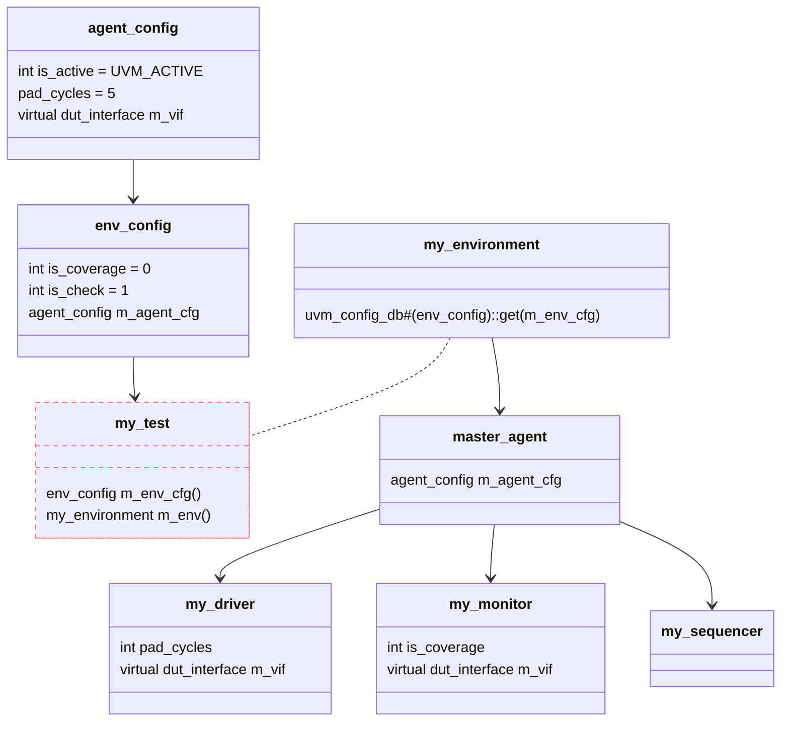

# UVM LEARN

## UVM Factory

### What is Factory?

- The UVM Factory mechanism(机制) allows users to replace different class(类) without modifying the code
- Factory is a built-in data structure in UVM
  - It operates within the entire platform space
  - It has only one instantiated object (i.e., a singleton class)
  - It serves as a polymorphic(多态) constructor --> Allows users to instantiate many different types of class using just one function.
- Factory object must be derived from a base class (called `uvm_object`?)
  - It's in order to return multiple types of class from just one function


### How Factory Work?

UVM has 2 LUTs (Look-Up Tables) to implement Factory mechanism:

1. Register table
2. Override table
   1. The replacement classes must have an inheritance(继承) relationship


The workflow of the Factory:

1. Register user-defined classes in the register-table
2. Use `class_name::type_id::create()` to create an object instead `new()`
3. Add replacement classes in the replace-table
   - The replaced-class must be the base-class of the replacement-class
4. UVM will automatically implement the Factory mechanism based on these 2 tables during the simulation

### Register Macro

\``uvm_object_utils` and \``uvm_object_param_utils`
\``uvm_component_utils` and \``uvm_component_param_utils`

The workflow of these 4 register macro:

1. Create a proxy(代理) class for the registered class: which named 'type_id'
   - 'type-id' is specifically used to replace the `new()` function, so it's called a proxy class
2. Create a registered class, Register the class in Factory (complex process)
3. Create a static function `type_id::create()`
   - To create an object of the specified class based on replace-table
4. Create a static function `type_id::get_type()`
5. Create a not-static function `type_id::get_object_type()`

The workflow of the create() function:

1. Call get() function of Factory to get Factory object
2. Based on the name of this-class, find wheather it's in the replace-table
   1. If it's not in the replace-table, call the `new()` function of this-class
   2. Else, call the `new()` function of the replacement-class

### Override Function

There are 2 common override functions,
These 2 functions exist in components and need to be used in `build_phase()` normally

```cpp
// original_class_name: the class that needs to be replaced
// replacement_class_name: the class that replaces the original class
set_type_override_by_type(
    original_class_name::get_type(),
    target_class_name::get_type()
);

set_inst_override_by_type(
    "original_inst_path",
    original_class_name::get_type(),
    target_class_name::get_type()
);
```

## UVM Transaction

1. Transaction (which defines by user) must be derived from `uvm_sequence_item` or another transaction class
2. Norlmally, transaction class has random variables
   1. How to close random variables?
        - use `this.XXXvariable.randmode(0)` in `new()` function
        - other methods...
   2. The constraint range of subclass must be within the range of the base-class

```verilog
// eg.
rand bit [3:0] src_addr;
rand bit [3:0] dst_addr;
rand reg [7:0] payload [$];

`uvm_object_utils_begin(my_transaction)
    `uvm_field_int(src_addr, UVM_ALL_ON)
    `uvm_field_int(dst_addr, UVM_ALL_ON)
    `uvm_field_queue_int(payload, UVM_ALL_ON)
`uvm_object_utils_end
```

1. Used for transaction class
2. Used for print, copy, compare, pack, unpack, and recording
3. UVM field automation macro must in UVM register macro
   1. `uvm_object_utils_begin()`+`uvm_object_utils_end()`
   2. `uvm_component_utils_begin()`+`uvm_component_utils_end()`

|方法名|功能|
|---|---|
| **注!** | **以下方法仅限于使用了 UVM field automation macro 的成员, 如果有哪个成员没被 UVM field automation macro 注册, 则以下函数执行时会忽略这个成员** |
| print   | 打印出该对象所有的成员 |
| sprint  | 同 print, 但返回的是字符串 |
| clone   | 深度复制; 如果目标对象的成员中包含了其他对象, 则会调用该子对象的 clone 方法进行复制 |
| copy    | 浅复制; 如果目标对象的成员中包含了其他对象, 却也不会再调用该子对象的 copy 方法, 而仅对子对象的句柄进行复制 |
| compare | 深度比较 |
| pack    | 将对象的成员打包到一个字节流中 |
| unpack  | 从字节流中解包对象的成员 |
| record  | 对成员做记录 |

Macro `uvm_field_xxx(ARG, FLAG)`:

1. xxx: type of the variable
2. ARG: name of the variable
3. FLAG: switch

Common macro:

```verilog
`uvm_field_int(ARG, FLAG)
`uvm_field_real(ARG, FLAG)
`uvm_field_enum(ARG, FLAG)
`uvm_field_object(ARG, FLAG)
`uvm_field_string(ARG, FLAG)

`uvm_field_array_enum(ARG, FLAG)
`uvm_field_array_int(ARG, FLAG)
`uvm_field_array_string(ARG, FLAG)

`uvm_field_queue_int(ARG, FLAG)
`uvm_field_queue_string(ARG, FLAG)

`uvm_field_aa_int_string(ARG, FLAG)
`uvm_field_aa_string_string(ARG, FLAG)
```

FLAG identifier:

```verilog
// A=ABSTRACT, Y=PHYSICAL, F=REFERENCE, S=SHALLOW, D=DEEP
// K=PACK, R=RECORD, P=PRINT, M=COMPARE, C=COPY

// ------------------------ AYFSD   K  R  P  M  C
parameter UVM_DEFAULT   = `b00001_01_01_01_01_01;
parameter UVM_ALL_ON    = `b00000_01_01_01_01_01;

// value are or `ed into a 32 bit value
parameter UVM_COPY      = (1<<0); parameter UVM_NOCOPY    = (1<<1);
parameter UVM_COMPARE   = (1<<2); parameter UVM_NOCOMPARE = (1<<3);
parameter UVM_PRINT     = (1<<4); parameter UVM_NOPRINT   = (1<<5);
parameter UVM_RECORD    = (1<<6); parameter UVM_NORECORD  = (1<<7);
parameter UVM_PACK      = (1<<8); parameter UVM_NOPACK    = (1<<9);

// Type of print/record
UVM_BIN, UVM_DEC, UVM_UNSIGNED, UVM_OCT, UVM_HEX, UVM_STRING, UVM_TIME, UVM_REAL

// Use "|" to combine multiple flags
// eg.
`uvm_field_int(var_name, UVM_ALL_ON | UVM_BIN)    // print in 2-bits binary
```

## UVM Information

### UVM Information Macro

```py
ID : String = "message ID"
MSG : String = "message content"
VERBOSITY : Enum = MESSAGE_SAFE_LEVEL

typedef enum {
    UVM_NONE   = 0,
    UVM_LOW    = 100,
    UVM_MEDIUM = 200,
    UVM_HIGH   = 300,
    UVM_FULL   = 400,
    UVM_DEBUG  = 500
} uvm_verbosity;

# prj\uvm-1.1d\src\macros\uvm_message_defines.svh
`define uvm_info(ID,MSG,VERBOSITY) \
   begin \
     if (uvm_report_enabled(VERBOSITY,UVM_INFO,ID)) \
       uvm_report_info (ID, MSG, VERBOSITY, `uvm_file, `uvm_line); \
   end

# eg.
`uvm_info("MON_RESET_PHASE", "Monitor 正在进行复位", UVM_MEDIUM)
```

<center>
form: uvm imformation safe level
</center>

| SAFE LEVEL      | UVM_EXIT  | UVM_COUNT | UVM_DISPLAY | UVM_LOG | UVM_CALL_HOOK | UVM_NO_ACTION |
| --------------- | --------- | --------- | ----------- | ------- | ------------- | ------------- |
| **UVM_FATAL**   | Default_2 | /         | Default_1   | /       | /             | /             |
| **UVM_ERROR**   | /         | Default_2 | Default_1   | /       | /             | /             |
| **UVM_WARNING** | /         | /         | Default     | /       | /             | /             |
| **UVM_INFO**    | /         | /         | /           | Default | /             | /             |

<center>
form: uvm imformation sim behavior
</center>

| SIM BEHAVIOR | DESCRIPTION |
| ------------ | ----------- |
| UVM_EXIT     | Exit the simulation immediately |
| UVM_COUNT    | Count the number of UVM_ERROR messages when simulate. <br> If it's up to the top limit, exit the simulation. <br> Use `set_report_max_quit_count()` to set the top limit|
| UVM_DISPLAY  | Display the message on the console |
| UVM_LOG      | Write the message to the log file |
| UVM_CALL_HOOK| Call the hook function |
| UVM_NO_ACTION| Do nothing |

Default macro of UVM INFORMATION:

1. `uvm_fatal(str : ID, str : MSG)`
2. `uvm_error(str : ID, str : MSG)`
3. `uvm_warning(str : ID, str : MSG)`
4. `uvm_info(str : ID, str : MSG, int : VERBOSITY)`

### Set Info Report Level

Warning: *`uvm_fatal`, `uvm_error`, `uvm_warning` will be printed in any case, witch means they won't be filtered by the report level*

#### SIM-CMD (Global)

Use `+UVM_VERBOSITY=UVM_*` (UVM_LOW, UVM_MEDIUM, UVM_HIGH, UVM_FULL, UVM_DEBUG)
If didn't set, the default level is UVM_MEDIUM

#### UVM-FUNC (Comp)

Use function to configure individual component or hierarchy

```verilog
set_report_verbosity_level(verbosity);
set_report_verbosity_level_hier(verbosity);
```

## UVM Configuration

UVM Configuration is a tool to configure attributes

1. Pass(传递) Value
2. Pass Object
3. Pass Interface

```verilog
// eg. user\sim_uvm\top\my_test.sv

// Source(uvm_component): this (my_test)
// Path: "*.m_seqr.run_phase"
// Type: ...
// ID: "default_sequence" -> any name you want
// Value: my_sequence::get_type()
uvm_config_db#(uvm_object_wrapper)::set(
    this, "*.m_seqr.run_phase", "default_sequence", my_sequence::get_type()
);

```

The feature of UVM Configuration:

1. Semi-global(半全局) variable -> avoid the risk associated with global variable
2. High-level component can change the variable of their included sub-components without modifying the code
3. UVM Configuration can be used at **EVERY LEVEL**
4. Support **wildcard**(通配符) and **RegEx**(正则表达式) -> for path searching, and can configure multiple variables
5. Support user-defined data type -> value, object, interface
6. Dynamic configure during the simulation

### Use UVM Configuration

`uvm_config_db#(type)::set()` and `uvm_config_db#(type)::get()` is a couple of functions:

1. In Low-level component, use `get()` to get the configuration
2. In High-level component, use `set()` to set the configuration
3. 3rd parameter of `set()` and `get()` must be the same (parameter: string field_name)


```verilog
// prj\uvm-1.1d\src\base\uvm_config_db.svh -> line 148
uvm_config_db#(type)::set(
    uvm_component   cntxt,
    string          inst_name,
    string          field_name,
    T               value
);
uvm_config_db#(type)::get(
    uvm_component   cntxt,
    string          inst_name,
    string          field_name,
    inout T         value
);
```

<center>
Set Configuration: UVM resource database
</center>

| Source(UVM_Comp) | Path         | Type          | ID         | Value     |
| ---------------- | ------------ | ------------- | ---------- | --------- |
| uvm_top          | "*.m_seqr"   | int           | "num"      | 10        |
| uvm_test_top     | "*.m_agent   | str           | "massage"  | "config"  |
| m_env            | "*.m_master" | uvm_object    | "m_config" | my_config |
| m_agent          | "*.m_drv"    | uvm_component | "m_comp"   | my_comp   |
| ...              | ...          | ...           | ...        | ...       |

### Configure object

Configure user-defined object

1. "Configurable property" provide a way to implement paltform reusability(复用性)
2. You can package "all congiguration items of a component" into a configuration object(class)
3. The configuration object is configured as a whole



